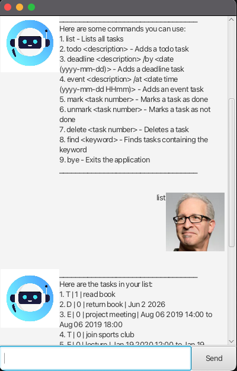

# ByteBuddy 🤖☕

ByteBuddy is a **Java chatbot** inspired by the Java mascot _Duke_.  
It comes with a clean **JavaFX graphical interface (GUI)** for chatting with your personal task assistant.

---

## ✨ Features

- 🗂️ Manage your tasks (Todo, Deadline, Event)
- ✅ Mark and unmark tasks as done
- 🔍 Find tasks by keyword
- 🆘 Built-in `help` command for guidance
- 🎉 Loads with sample data on first run to get you started
- 💻 Simple **JavaFX GUI** for smooth interaction

---

## 📦 Prerequisites

- **JDK 17**
- **IntelliJ IDEA** (recommended)
- **Gradle** (optional; IntelliJ can manage it automatically)

---

## 🚀 Getting Started

### Open in IntelliJ
1. Open IntelliJ.  
   *(If you are not on the welcome screen, click `File` > `Close Project` to close any open project.)*
2. Open the project:
    - Click **Open**.
    - Select the project root directory.
    - Accept any prompts with default options.
3. Configure **JDK 17**:
    - `File > Project Structure > Project`
    - Set **Project SDK** to JDK 17
    - Set **Project language level** to `SDK Default`  
      👉 [More details](https://www.jetbrains.com/help/idea/sdk.html#set-up-jdk)
4. Run the app:
    - **Option 1 (IntelliJ):** Right-click `Main.java` in `src/main/java/bytebuddy/gui/` → **Run 'Main.main()'**
    - **Option 2 (Gradle):** Run in terminal:
      ```bash
      ./gradlew run
      ```

---

## 📸 Demo

---

## 🛠️ Development Notes

- Keep `src/main/java` as the source root.
- All interaction now happens via the **GUI** (CLI `run()` is deprecated).
- A GitHub Actions workflow (`.github/workflows/ci.yml`) is included for **CI/CD** – it builds and tests the project on every commit/PR.
- To package a runnable JAR with JavaFX included:
  ```bash
  ./gradlew shadowJar
