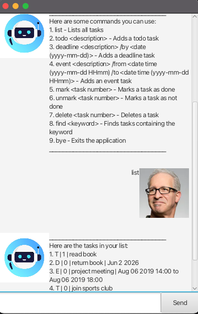

# ByteBuddy 🤖☕

ByteBuddy is a **Java chatbot** inspired by the Java mascot _Duke_.  
It comes with a clean **JavaFX graphical interface (GUI)** for chatting with your personal task assistant.

---

## ✨ Features

- 🗂️ Manage your tasks (Todo, Deadline, Event)
- ✅ Mark and unmark tasks as done
- 🔍 Find tasks by keyword
- 🆘 Built-in `help` command for guidance
- 🎉 Loads with sample data on first run to get you started
- 💻 Simple **JavaFX GUI** for smooth interaction

---

## 📦 Prerequisites

- **JDK 17**
- **IntelliJ IDEA** (recommended)
- **Gradle** (optional; IntelliJ can manage it automatically)

---

## 🚀 Getting Started

### Open in IntelliJ
1. Open IntelliJ.  
   *(If you are not on the welcome screen, click `File` > `Close Project` to close any open project.)*
2. Open the project:
    - Click **Open**.
    - Select the project root directory.
    - Accept any prompts with default options.
3. Configure **JDK 17**:
    - `File > Project Structure > Project`
    - Set **Project SDK** to JDK 17
    - Set **Project language level** to `SDK Default`  
      👉 [More details](https://www.jetbrains.com/help/idea/sdk.html#set-up-jdk)
4. Run the app:
    - **Option 1 (IntelliJ):** Right-click `Main.java` in `src/main/java/bytebuddy/gui/` → **Run 'Main.main()'**
    - **Option 2 (Gradle):** Run in terminal:
      ```bash
      ./gradlew run
      ```

## 📖 Usage Guide

Once ByteBuddy is running, you can interact with it through natural commands.  
Here are all the commands you can use:

1. **`list`** – Lists all tasks currently in your task list.
2. **`todo <description>`** – Adds a Todo task.
    - Example: `todo Buy groceries`
3. **`deadline <description> /by <date (yyyy-mm-dd)>`** – Adds a Deadline task.
    - Example: `deadline Submit report /by 2025-09-30`
4. **`event <description> /from <date time (yyyy-mm-dd HHmm)> /to <date time (yyyy-mm-dd HHmm)>`** – Adds an Event task with a start and end time.
    - Example: `event Hackathon /from 2025-09-20 0900 /to 2025-09-20 2100`
5. **`mark <task number>`** – Marks a task as done.
    - Example: `mark 2`
6. **`unmark <task number>`** – Marks a task as not done.
    - Example: `unmark 2`
7. **`delete <task number>`** – Deletes a task.
    - Example: `delete 3`
8. **`find <keyword>`** – Finds tasks containing the keyword.
    - Example: `find report`
9. **`bye`** – Exits the application gracefully.

💡 Tip: You can type `help` anytime in the app to bring up this command list again.

---

## 📸 Demo


---
## 🛠️ Development Notes

- Keep `src/main/java` as the source root.
- All interaction now happens via the **GUI** (CLI `run()` is deprecated).
- A GitHub Actions workflow (`.github/workflows/ci.yml`) is included for **CI/CD** – it builds and tests the project on every commit/PR.
- To package a runnable JAR with JavaFX included:
  ```bash
  ./gradlew shadowJar
