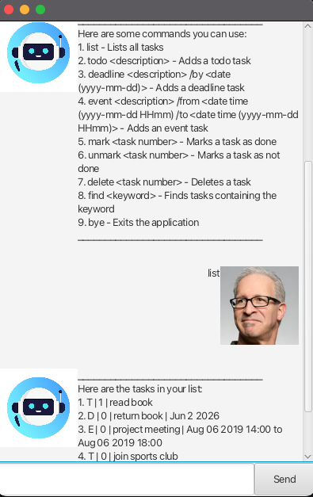

# ByteBuddy User Guide

<!-- Product intro goes here -->
ByteBuddy is a simple **Java chatbot task manager** that helps you track, organize, and manage your tasks efficiently.  
It supports **Todos**, **Deadlines**, and **Events**, and allows you to mark, unmark, delete, find tasks, and more.
It comes with a clean **JavaFX graphical interface (GUI)** for chatting with your personal task assistant.

---

## ✨ Features

- 🗂️ Manage your tasks (Todo, Deadline, Event)
- ✅ Mark and unmark tasks as done
- 🔍 Find tasks by keyword
- 🆘 Built-in `help` command for guidance
- 🎉 Loads with sample data on first run to get you started
- 💻 Simple **JavaFX GUI** for smooth interaction

---

## 📦 Prerequisites

- **JDK 17**
- **IntelliJ IDEA** (recommended)
- **Gradle** (optional; IntelliJ can manage it automatically)

---

## 🚀 Getting Started

### Open in IntelliJ
1. Open IntelliJ.  
   *(If you are not on the welcome screen, click `File` > `Close Project` to close any open project.)*
2. Open the project:
    - Click **Open**.
    - Select the project root directory.
    - Accept any prompts with default options.
3. Configure **JDK 17**:
    - `File > Project Structure > Project`
    - Set **Project SDK** to JDK 17
    - Set **Project language level** to `SDK Default`  
      👉 [More details](https://www.jetbrains.com/help/idea/sdk.html#set-up-jdk)
4. Run the app:
    - **Option 1 (IntelliJ):** Right-click `Main.java` in `src/main/java/bytebuddy/gui/` → **Run 'Main.main()'**
    - **Option 2 (Gradle):** Run in terminal:
      ```bash
      ./gradlew run
      ```
      
---

## 📸 Demo


---

## 📖 Usage Guide

Once ByteBuddy is running, you can interact with it through natural commands.  
Here are all the commands you can use:

1. **`list`** – Lists all tasks currently in your task list.
2. **`todo <description>`** – Adds a Todo task.
    - Example: `todo Buy groceries`
3. **`deadline <description> /by <date (yyyy-mm-dd)>`** – Adds a Deadline task.
    - Example: `deadline Submit report /by 2025-09-30`
4. **`event <description> /from <date time (yyyy-mm-dd HHmm)> /to <date time (yyyy-mm-dd HHmm)>`** – Adds an Event task with a start and end time.
    - Example: `event Hackathon /from 2025-09-20 0900 /to 2025-09-20 2100`
5. **`mark <task number>`** – Marks a task as done.
    - Example: `mark 2`
6. **`unmark <task number>`** – Marks a task as not done.
    - Example: `unmark 2`
7. **`delete <task number>`** – Deletes a task.
    - Example: `delete 3`
8. **`find <keyword>`** – Finds tasks containing the keyword.
    - Example: `find report`
9. **`bye`** – Exits the application gracefully.

💡 Tip: You can type `help` anytime in the app to bring up this command list again.

---

## Listing tasks

List all tasks currently in your list.  
This shows type, status, description, and extra info for all tasks.

**Example:**  
`list`

**Expected outcome:**
```
Here are the tasks in your list:
T | 0 | read book
D | 0 | return book | Sep 20 2025
E | 0 | project meeting | 17 Sep 2025 14:00 to 17 Sep 2025 16:00
```

---

## Adding todos

Add a **todo task** with only a description.  
The task will appear in your list with type `T` and status `0` (not done) or `1` (done).

**Example:**  
`todo read book`

**Expected outcome:**  
```
Got it. I've added this task:
T | 0 | read book
Now you have 1 task in the list.
```

---

## Adding deadlines

Add a **deadline task** with a description and due date.  
The task will appear in your list with its type (`D`), status `0` (not done) or `1` (done), 
description, and formatted due date.

**Example:**  
`deadline return book /by 2025-09-20`

**Expected outcome:**  
```
Got it. I've added this task:
D | 0 | return book | Sep 20 2025
Now you have 2 tasks in the list.
```

---

## Adding events

Add an **event task** with a description,  
The task will appear in your list with type `E`, status `0` (not done) or `1` (done), 
description, and the start datetime, and end datetime.

**Example:**  
`event project meeting /from 2025-09-17 1400 /to 2025-09-17 1600`

**Expected outcome:**  
```
Got it. I've added this task:
E | 0 | project meeting | 17 Sep 2025 14:00 to 17 Sep 2025 16:00
Now you have 3 tasks in the list.
```

---

## Marking tasks

Mark a task as **done** by its task number.  
The task’s status will change to `1`.

**Example:**  
`mark 1`

**Expected outcome:**  
```
Nice! I've marked this task as done:
T | 1 | read book
```

---

## Unmarking tasks

Mark a task as **not done** by its task number.  
The task’s status will revert to `0`.

**Example:**  
`unmark 1`

**Expected outcome:**  
```
OK, I've marked this task as not done yet:
T | 0 | read book
```

---

## Deleting tasks

Remove a task from your list by its task number.

**Example:**  
`delete 3`

**Expected outcome:**  
```
Noted. I've removed this task:
E | 0 | project meeting | 17 Sep 2025 14:00 to 17 Sep 2025 16:00
Now you have 2 tasks in the list.
```

---

## Finding tasks

Search for tasks containing a keyword.  
Matching tasks are displayed with their type, status, description, and extra info.

**Example:**  
`find book`

**Expected outcome:**  
```
Here are the matching tasks in your list:
T | 0 | read book
D | 0 | return book | Sep 20 2025
```

---

## Exiting ByteBuddy

Exit the application gracefully.

**Example:**  
`bye`

**Expected outcome:**  
```
Bye. Hope to see you again soon!
```
---

## Getting help

Display a list of all available commands and their usage.

**Example:**  
`help`

**Expected outcome:**  
```
Here are some commands you can use:
list - Lists all tasks
todo <description> - Adds a todo task
deadline <description> /by <date (yyyy-mm-dd)> - Adds a deadline task
event <description> /from <yyyy-mm-dd HHmm> /to <yyyy-mm-dd HHmm> - Adds an event task
mark <task number> - Marks a task as done
unmark <task number> - Marks a task as not done
delete <task number> - Deletes a task
find <keyword> - Finds tasks containing the keyword
bye - Exits the application
```

---

## 🛠️ Development Notes

- Keep `src/main/java` as the source root.
- All interaction now happens via the **GUI** (CLI `run()` is deprecated).
- A GitHub Actions workflow (`.github/workflows/ci.yml`) is included for **CI/CD** – it builds and tests the project on every commit/PR.
- To package a runnable JAR with JavaFX included:
  ```bash
  ./gradlew shadowJar
  
---
